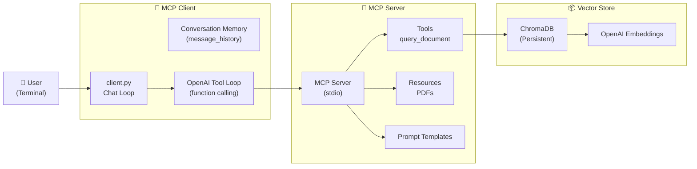
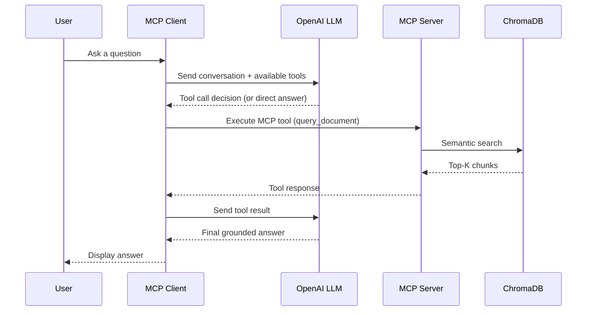

# MCP-Based Document Intelligence Platform

A production-grade **Model Context Protocol (MCP)** powered document intelligence system that enables **tool-aware, prompt-driven, retrieval-augmented question answering** over PDFs using **OpenAI**, **ChromaDB**, and a **custom MCP client–server architecture**.

This project demonstrates how modern LLM applications can expose **capabilities (tools, resources, prompts)** via MCP and allow intelligent clients to reason, retrieve, and respond dynamically.
---
## 🚀 What This Project Does

- 📄 **Indexes PDF documents** into a persistent Chroma vector store
- 🧠 **Exposes document search as an MCP tool** (`query_document`)
- 🔎 **Performs semantic retrieval** using OpenAI embeddings
- 🤖 **Lets an LLM decide when to call tools vs answer directly**
- 🧩 **Supports MCP resources** (readable PDFs)
- 🧠 **Supports MCP prompt templates** (deep analysis, extraction, etc.)
- 💬 **Maintains multi-turn conversational memory**
- 🔁 **Implements a full OpenAI tool-calling loop**
- 🖥 **Runs fully locally** via STDIO-based MCP transport

---
## 💡 Why This Matters

Traditional RAG systems tightly couple retrieval logic with the application.

This project demonstrates a **protocol-first architecture** where:
- Capabilities are **discoverable**
- Clients are **model-agnostic**
- Tools, resources, and prompts are **first-class primitives**
- LLMs can **reason over what the system can do**

This mirrors how **enterprise agent platforms** and **multi-agent systems** are being built today.

---

## 🏗️ High Level Architecture Diagram
  

---
## 🏗️ Execution Sequence (End-to-End)

---

## 📁 Project Structure
```text
mcp-document-intelligence/
├── MCP_Setup.ipynb           # One-time ingestion: PDF → chunks → embeddings → Chroma
├── mcp_server.py             # MCP server exposing tools, resources, prompts
├── client.py                 # MCP client with OpenAI tool loop + chat UI
│
├── testing/
│   └── .gitkeep              # Placeholder (PDFs ignored by git)
├── .gitignore                # Ignores envs, chroma, PDFs, caches
│
├── pyproject.toml            # uv project config
├── uv.lock                   # Locked dependencies
└── README.md                 # Project documentation
```
---
## 🔄 End-to-End Pipeline

### 1️⃣ Document Ingestion (Offline)

**Trigger**

Triggered manually via notebook

**Steps**
1. **Load PDF documents**
2. **Chunk documents into semantic segments**
3. **Generate embeddings using OpenAI**
4. **Persist vectors + metadata to ChromaDB**

- This step is decoupled from runtime querying.

---

### 2️⃣ MCP Server Initialization

When the server starts:
- Registers **tools, resources, and prompts**.
- Connects to the **persistent Chroma collection**.
- Exposes everything via **MCP descriptors**.
- Clients can discover capabilities dynamically.

---

### 3️⃣ Runtime Querying (Online)

1. **User asks a question**
2. **Client builds conversation history**
3. **Client sends:**
   - Messages
   - Available Tools
4. **OpenAI decides:**
   - Answer directly or
   - Call query_document
5. **Tool executes via MCP**
6. **Results returned to LLM**
7. **Final grounded answer generated**
---

### ✅ Tool-Aware Reasoning Example

- Direct Answer (No Tool Call)

```bash
  Query: What is the capital of Telangana?

→ LLM answers directly
  ```

- Tool-Based Answer
```bash
Query: What is the main topic discussed in the document?

→ LLM requests query_document
→ MCP executes semantic search
→ LLM grounds answer in retrieved chunks
```
---
## 🛠️ Prerequisites

### Local Development
- **Python 3.11+**
- **[`uv`](https://github.com/astral-sh/uv)** – fast Python package & environment manager
- **Git**
- **OpenAI, OpenAI API key**

---
## ⚙️ Setup Instructions

### 1️⃣ Clone the repository

```bash
git clone https://github.com/your-username/mcp-document-intelligence.git
cd mcp-document-intelligence
```

### 2️⃣ Create and activate a virtual environment
This project uses uv for fast and reproducible Python environments.
```bash
uv venv
source .venv/bin/activate
```
You should now see (.venv) in your terminal prompt.

### 3️⃣ Install dependencies
Install all required dependencies exactly as defined in pyproject.toml and uv.lock.
```bash
uv sync
```
### 4️⃣ Configure environment variables
Create a .env file inside the weather/ directory:
```bash
OPENAI_API_KEY=your_openai_api_key
```
### 5️⃣ Run ingestion (one-time)

```bash
uv run jupyter notebook MCP_Setup.ipynb
```

### Start MCP server and Client

```bash
uv run python client.py mcp_server.py
```

### Example query:


```bash
/prompts
/prompt deep_analysis methodology
/resources
/resource document://pdf/ft_guide
/tools
```
------

## 🚀 Future Enhancements
1. **Multi-round tool execution loop**
2. **Streaming responses**
3. **Authenticated MCP endpoints**
4. **Web-based client (FastAPI / WebSockets)**
5. **Multi-agent orchestration**

